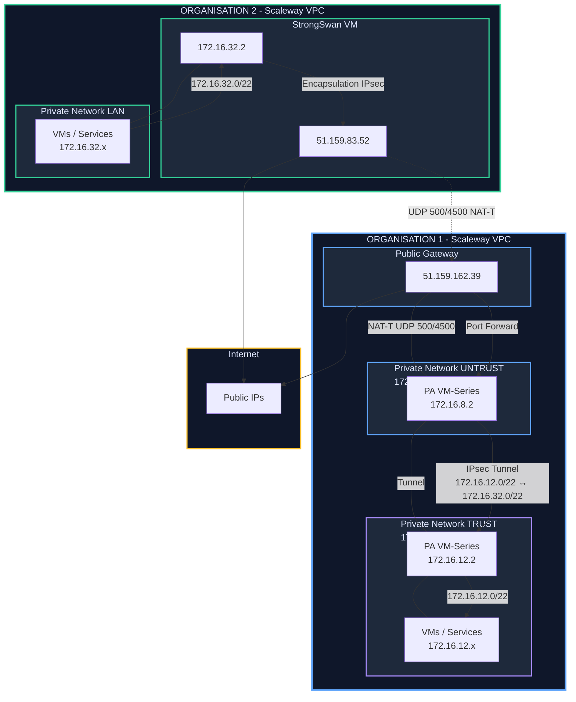

# Palo Alto ↔ StrongSwan – IPsec Site-to-Site (Scaleway)

##  High-level Diagram

---

##  Files in this repository

- `palo-alto.conf` – CLI configuration snippet for the Palo Alto VM-Series  
  (interfaces, zones, IKE gateway, IPsec tunnel, routes, security rules).
- `scw-stgswan.sh` – StrongSwan installation & configuration script  
  (installs strongSwan, configures `ipsec.conf` and `ipsec.secrets`).

---

##  Addresses & Roles (reference)

**Palo Alto VM-Series (VPC1)**  
- TRUST (LAN) : `172.16.12.2/22` → `172.16.12.0/22`  
- UNTRUST : `172.16.8.2/22` (vers NAT GW `172.16.8.3`)  

**NAT Gateway (VPC1)**  
- Publique : `51.159.162.39`  
- Privée : `172.16.8.3/22`  
- Port forwarding obligatoire :
  - UDP `500` → `172.16.8.2`
  - UDP `4500` → `172.16.8.2`

**StrongSwan (VPC2)**  
- Publique : `51.159.83.52`  
- Privée : `172.16.32.2/22` → `172.16.32.0/22`

---

##  IPsec Parameters (shared)

- IKE version : **IKEv2**
- IKE crypto : `aes256-sha256-modp2048`
- ESP crypto : `aes256-sha256`
- PSK (example used in this lab):

  ```text
  ko+alRLwBjRIVfca+1w5XpHr/1zCNMaWpZpsk15lD1w=
  ```

- Protected subnets:
  - Palo Alto side : `172.16.12.0/22`
  - StrongSwan side : `172.16.32.0/22`

---

##  Usage

### 1. Palo Alto

1. Connect to the Palo Alto CLI.
2. Load/apply the configuration from **`palo-alto.conf`**  
   (adapt interfaces, zones, IPs, and PSK if needed).
3. Commit and verify:

   ```bash
   > show vpn ike-sa
   > show vpn ipsec-sa
   > show routing route
   ```

### 2. StrongSwan VM (Ubuntu/Debian)

1. Copy **`scw-stgswan.sh`** to the StrongSwan VM.
2. Make it executable and run it:

   ```bash
   chmod +x scw-stgswan.sh
   sudo ./scw-stgswan.sh
   ```

3. Copy your values
   ```bash
    cd /root
    sed -i "s/^PALO_ALTO_GW=\"\"/PALO_ALTO_GW=\"51.159.162.39\"/" scw-stgswan.sh
    sed -i "s/^PALO_ALTO_ID=\"\"/PALO_ALTO_ID=\"172.16.8.2\"/" scw-stgswan.sh
    sed -i "s/^PSK=\"\"/PSK=\"ko+alRLwBjRIVfca+1w5XpHr\/1zCNMaWpZpsk15lD1w=\"/" scw-stgswan.sh
    sed -i "s/^LOCAL_ID=\"\"/LOCAL_ID=\"51.159.83.52\"/" scw-stgswan.sh
    sed -i "s/^LOCAL_SUBNET=\"\"/LOCAL_SUBNET=\"172.16.32.0\/22\"/" scw-stgswan.sh
    sed -i "s/^REMOTE_SUBNET=\"\"/REMOTE_SUBNET=\"172.16.12.0\/22\"/" scw-stgswan.sh
    sed -i "s/^VPC_INTERFACE=\"ens2\"/VPC_INTERFACE=\"ens6\"/" scw-stgswan.sh
    sed -i "s/^WAN_INTERFACE=\"ens2\"/WAN_INTERFACE=\"ens2\"/" scw-stgswan.sh
   ```

4. Check the tunnel status:

   ```bash
   ipsec statusall
   ```

If both sides are correctly configured, you should see an **ESTABLISHED** IKE SA and be able to reach:

- From Palo Alto LAN (`172.16.12.0/22`) → `172.16.32.0/22`
- From StrongSwan LAN (`172.16.32.0/22`) → `172.16.12.0/22`


### 3. Configuration de VM Cliente & VM StrongSwan pour autoriser un accès internet aux VMs cliente

1. Côté Serveur Strongswan
   ```bash
    sudo sysctl -w net.ipv4.ip_forward=1
   ```
   ---
   
   ```bash
    WAN_IF=ens2
    
    iptables -t nat -A POSTROUTING -s 172.16.32.0/22 -o $WAN_IF -j MASQUERADE
    iptables -A FORWARD -s 172.16.32.0/22 -o $WAN_IF -j ACCEPT
    iptables -A FORWARD -d 172.16.32.0/22 -i $WAN_IF -m state --state ESTABLISHED,RELATED -j ACCEPT
    netfilter-persistent save 2>/dev/null || true
   ```

3. Côté Client Strongswan

   ```bash
   # Ajoute la route par défaut vers 172.16.32.2 (SRV StrongSwan)
    ip route add default via 172.16.32.2
   ```
   ---

   Tests rapides
   Sur la VM cliente :
   ```bash
   # Vers le serveur StrongSwan (LAN)
   ping 172.16.32.2
   # Vers Internet
   ping 1.1.1.1
   ping google.com
   ```
 
4. Check connectivity

   ```bash
    root@scw-strongswan-client:~# ip route show
    default via 172.16.32.2 dev ens6
    169.254.42.42 dev ens6 proto dhcp scope link src 172.16.32.3 metric 50
    169.254.169.254 dev ens6 proto dhcp scope link src 172.16.32.3 metric 50
    172.16.32.0/22 dev ens6 proto kernel scope link src 172.16.32.3 metric 50
    root@scw-strongswan-client:~# ping google.com -c2
    PING google.com (216.58.214.78) 56(84) bytes of data.
    64 bytes from fra15s10-in-f78.1e100.net (216.58.214.78): icmp_seq=1 ttl=116 time=2.60 ms
    64 bytes from fra15s10-in-f78.1e100.net (216.58.214.78): icmp_seq=2 ttl=116 time=3.24 ms
    
    --- google.com ping statistics ---
    2 packets transmitted, 2 received, 0% packet loss, time 1002ms
    rtt min/avg/max/mdev = 2.602/2.923/3.244/0.321 ms
    root@scw-strongswan-client:~#
   ```

5. Factory Reset

   ```bash
    # 1. Stopper et désactiver StrongSwan + éventuels services VPN custom
    systemctl stop strongswan-starter strongswan ipsec 2>/dev/null || true
    systemctl disable strongswan-starter strongswan ipsec 2>/dev/null || true
    
    systemctl stop vpn-healthcheck.service vpn-routes.service 2>/dev/null || true
    systemctl disable vpn-healthcheck.service vpn-routes.service 2>/dev/null || true
    
    # 2. Supprimer les units / scripts perso éventuels
    rm -f /etc/systemd/system/vpn-healthcheck.service
    rm -f /etc/systemd/system/vpn-routes.service
    rm -f /usr/local/bin/vpn-healthcheck.sh
    rm -f /usr/local/bin/vpn-status.sh
    rm -f /usr/local/bin/setup-vpn-routes.sh
    rm -f /usr/local/bin/cleanup-vpn-routes.sh
    
    systemctl daemon-reload
    
    # 3. Supprimer toute la config StrongSwan
    rm -f /etc/ipsec.conf
    rm -f /etc/ipsec.secrets
    rm -rf /etc/strongswan* /var/lib/strongswan
    
    # 4. Supprimer les réglages sysctl VPN
    rm -f /etc/sysctl.d/99-vpn.conf
    rm -f /etc/sysctl.d/99-ipforward.conf
    sysctl --system
    
    # 5. Réinitialiser iptables + règles persistantes
    iptables -F
    iptables -t nat -F
    iptables -t mangle -F
    iptables -X
    
    rm -f /etc/iptables/rules.v4 /etc/iptables/rules.v6
    netfilter-persistent save 2>/dev/null || true
    
    # 6. Désinstaller complètement StrongSwan et les outils associés
    apt-get purge -y "strongswan*" iptables-persistent netfilter-persistent
    apt-get autoremove -y
    apt-get clean
   ```
