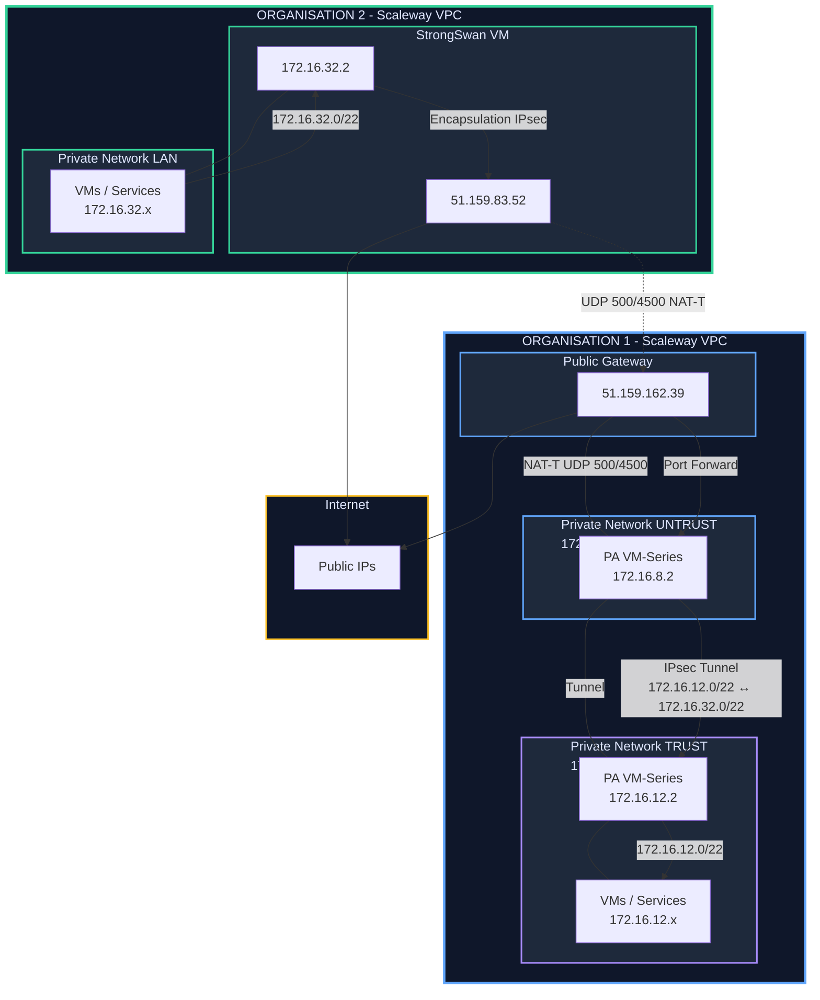

# Palo Alto ↔ StrongSwan – IPsec Site-to-Site (Scaleway)

##  High-level Diagram


---
```
---

##  Files in this repository

- `palo-alto.conf` – CLI configuration snippet for the Palo Alto VM-Series  
  (interfaces, zones, IKE gateway, IPsec tunnel, routes, security rules).
- `scw-stgswan.sh` – StrongSwan installation & configuration script  
  (installs strongSwan, configures `ipsec.conf` and `ipsec.secrets`).

---

##  Addresses & Roles (reference)

**Palo Alto VM-Series (VPC1)**  
- TRUST (LAN) : `172.16.12.2/22` → `172.16.12.0/22`  
- UNTRUST : `172.16.8.2/22` (vers NAT GW `172.16.8.3`)  

**NAT Gateway (VPC1)**  
- Publique : `51.159.162.39`  
- Privée : `172.16.8.3/22`  
- Port forwarding obligatoire :
  - UDP `500` → `172.16.8.2`
  - UDP `4500` → `172.16.8.2`

**StrongSwan (VPC2)**  
- Publique : `51.159.83.52`  
- Privée : `172.16.32.2/22` → `172.16.32.0/22`

---

##  IPsec Parameters (shared)

- IKE version : **IKEv2**
- IKE crypto : `aes256-sha256-modp2048`
- ESP crypto : `aes256-sha256`
- PSK (example used in this lab):

  ```text
  ko+alRLwBjRIVfca+1w5XpHr/1zCNMaWpZpsk15lD1w=
  ```

- Protected subnets:
  - Palo Alto side : `172.16.12.0/22`
  - StrongSwan side : `172.16.32.0/22`

---

##  Usage

### 1. Palo Alto

1. Connect to the Palo Alto CLI.
2. Load/apply the configuration from **`palo-alto.conf`**  
   (adapt interfaces, zones, IPs, and PSK if needed).
3. Commit and verify:

   ```bash
   > show vpn ike-sa
   > show vpn ipsec-sa
   > show routing route
   ```

### 2. StrongSwan VM (Ubuntu/Debian)

1. Copy **`scw-stgswan.sh`** to the StrongSwan VM.
2. Make it executable and run it:

   ```bash
   chmod +x scw-stgswan.sh
   sudo ./scw-stgswan.sh
   ```

3. Check the tunnel status:

   ```bash
   ipsec statusall
   ```

If both sides are correctly configured, you should see an **ESTABLISHED** IKE SA and be able to reach:

- From Palo Alto LAN (`172.16.12.0/22`) → `172.16.32.0/22`
- From StrongSwan LAN (`172.16.32.0/22`) → `172.16.12.0/22`
