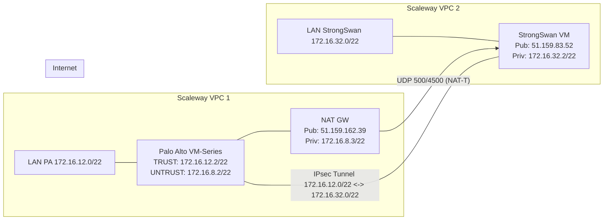

# Palo Alto ↔ StrongSwan – IPsec Site-to-Site (Scaleway)

##  High-level Diagram


---
```mermaid
graph TB
  subgraph INTERNET["🌐 Internet Public"]
    direction LR
    PA_PUB["51.159.83.78<br/>(PA VM-Series)"]
    SS_PUB["51.159.83.52<br/>(StrongSwan)"]
  end

  subgraph VPC1["Scaleway VPC 1 - UNTRUST Zone"]
    direction LR
    UNTRUST["Private Network<br/>172.16.8.0/22"]
    NATGW["Public Gateway + IGW<br/>Pub: 51.159.162.39<br/>Priv: 172.16.8.3/22<br/><br/>NAT-T: UDP 500/4500"]
    PA_UNTRUST["PA VM-Series<br/>UNTRUST Interface<br/>172.16.8.2/22"]
    UNTRUST --- PA_UNTRUST
    UNTRUST --- NATGW
  end

  subgraph VPC1_TRUST["Scaleway VPC 1 - TRUST Zone"]
    direction LR
    TRUST["Private Network<br/>172.16.12.0/22"]
    PA_TRUST["PA VM-Series<br/>TRUST Interface<br/>172.16.12.2/22"]
    TRUST --- PA_TRUST
  end

  subgraph VPC2["Scaleway VPC 2 - StrongSwan"]
    direction LR
    LAN2["Private Network<br/>172.16.32.0/22"]
    SS["StrongSwan VM<br/>Pub: 51.159.83.52<br/>Priv: 172.16.32.2/22"]
    LAN2 --- SS
  end

  PA_PUB -.->|Site-to-Site IPsec| SS_PUB
  NATGW -->|NAT-T<br/>UDP 500/4500| SS_PUB
  PA_UNTRUST -->|Tunnel Initiation| PA_PUB
  PA_TRUST -->|Encrypted Traffic<br/>172.16.12.0/22 ↔ 172.16.32.0/22| PA_UNTRUST

  style INTERNET fill:#e1f5ff
  style VPC1 fill:#fff3e0
  style VPC1_TRUST fill:#f3e5f5
  style VPC2 fill:#e8f5e9
 ``` 
---

```text
+-----------------------------+                         +-----------------------------+
|         Scaleway VPC 1      |                         |         Scaleway VPC 2      |
|        (Palo Alto side)     |                         |      (StrongSwan side)      |
|                             |                         |                             |
|  LAN PA : 172.16.12.0/22    |                         |  LAN SS : 172.16.32.0/22    |
|                             |                         |                             |
|   +---------------------+   |                         |   +---------------------+   |
|   |    Palo Alto VM     |   |                         |   |   StrongSwan VM     |   |
|   |---------------------|   |                         |   |---------------------|   |
|   | TRUST  : 172.16.12.2|   |                         |   | Priv : 172.16.32.2  |   |
|   | UNTRUST: 172.16.8.2 |-------------------------------IP Pub : 51.159.83.52   |   |
|   +---------------------+   |                         |   +---------------------+   |
|             |               |                         |                             |
|             | 172.16.8.0/22 |                         |                             |
|             v               |                         |                             |
|   +---------------------+   |                         |                             |
|   |     NAT Gateway     |   |                         |                             |
|   |---------------------|   |                         |                             |
|   | Priv : 172.16.8.3   |   |                         |                             |
|   | Pub  : 51.159.162.39|----------------------------------------+                  |
|   +---------------------+   |                         |          |                  |
+-----------------------------+                         +----------|------------------+
                                                                   |
                                                                   |  Internet
                                                                   |
                      =================== IPsec Tunnel ====================
                      172.16.12.0/22  <=========  VPN  =========>  172.16.32.0/22

```
---

##  Files in this repository

- `palo-alto.conf` – CLI configuration snippet for the Palo Alto VM-Series  
  (interfaces, zones, IKE gateway, IPsec tunnel, routes, security rules).
- `scw-stgswan.sh` – StrongSwan installation & configuration script  
  (installs strongSwan, configures `ipsec.conf` and `ipsec.secrets`).

---

##  Addresses & Roles (reference)

**Palo Alto VM-Series (VPC1)**  
- TRUST (LAN) : `172.16.12.2/22` → `172.16.12.0/22`  
- UNTRUST : `172.16.8.2/22` (vers NAT GW `172.16.8.3`)  

**NAT Gateway (VPC1)**  
- Publique : `51.159.162.39`  
- Privée : `172.16.8.3/22`  
- Port forwarding obligatoire :
  - UDP `500` → `172.16.8.2`
  - UDP `4500` → `172.16.8.2`

**StrongSwan (VPC2)**  
- Publique : `51.159.83.52`  
- Privée : `172.16.32.2/22` → `172.16.32.0/22`

---

##  IPsec Parameters (shared)

- IKE version : **IKEv2**
- IKE crypto : `aes256-sha256-modp2048`
- ESP crypto : `aes256-sha256`
- PSK (example used in this lab):

  ```text
  ko+alRLwBjRIVfca+1w5XpHr/1zCNMaWpZpsk15lD1w=
  ```

- Protected subnets:
  - Palo Alto side : `172.16.12.0/22`
  - StrongSwan side : `172.16.32.0/22`

---

##  Usage

### 1. Palo Alto

1. Connect to the Palo Alto CLI.
2. Load/apply the configuration from **`palo-alto.conf`**  
   (adapt interfaces, zones, IPs, and PSK if needed).
3. Commit and verify:

   ```bash
   > show vpn ike-sa
   > show vpn ipsec-sa
   > show routing route
   ```

### 2. StrongSwan VM (Ubuntu/Debian)

1. Copy **`scw-stgswan.sh`** to the StrongSwan VM.
2. Make it executable and run it:

   ```bash
   chmod +x scw-stgswan.sh
   sudo ./scw-stgswan.sh
   ```

3. Check the tunnel status:

   ```bash
   ipsec statusall
   ```

If both sides are correctly configured, you should see an **ESTABLISHED** IKE SA and be able to reach:

- From Palo Alto LAN (`172.16.12.0/22`) → `172.16.32.0/22`
- From StrongSwan LAN (`172.16.32.0/22`) → `172.16.12.0/22`
